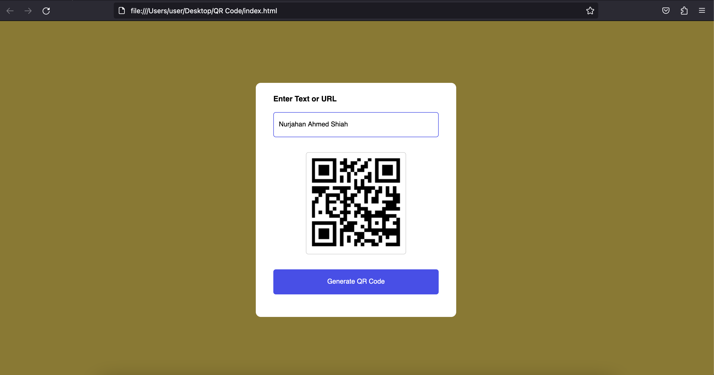

# QR-Code Generator
This simple web application allows you to generate QR codes by entering text or URLs. It's a handy tool for quickly creating QR codes for various purposes.
[Scan the QR Code below!]

## Table of Contents
- Features
- Usage
- License

## Features

- Generate QR codes from text or URLs.
- User-friendly interface.
- Error handling for empty input.

## Usage

1. Visit the QR Code Generator web application(feel free to download the files!).
2. Enter the text or URL for which you want to generate a QR code in the input field.
3. Click the "Generate QR Code" button.
4. Your QR code will be displayed in the box below.

## License

@author: Nurjahan Shiah

---

